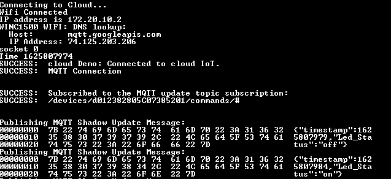

# Trust Platform Design Suite - Usecase Help - Google Connect

This document helps to understand Pre and Post steps of Usecase transaction diagram.

## Setup requirements
 - [DM320118](https://www.microchip.com/developmenttools/ProductDetails/DM320118)
 - [WIFI 7 CLICK](https://www.mikroe.com/wifi-7-click)
 - [MPLAB X IDE](https://www.microchip.com/en-us/development-tools-tools-and-software/mplab-x-ide) 5.45 or above

## Pre Usecase transaction Steps
 - Connect DM320118 board to PC running Trust Platform Design Suite
 - Ensure *MPLAB X Path* is set in *File* -> *Preference* under *System Settings*. This helps
    - To program the Usecase prototyping kit to factory reset application by TPDS
    - To open the embedded project of the Usecase
 - Setup GCP account. Follow the instructions at [**GCP demo account setup**](../../../docs/GCP_demo_account_setup.html)
 - Ensure *GCP_test_account_credentials.csv* in [TPDS_core/Docs](../../../docs) contains the account credentials.
 - On older versions of WIFI 7 click boards, It is required to upgrade the WIFI 7 click board firmware.
    - Run the *winc_firmware_update.bat* batch file in [TPDS_core/assets/winc_firmware_upgrade](../../../assets/winc_firmware_upgrade)
        - Note1: This requires [Microchip/Atmel Studio](https://www.microchip.com/en-us/development-tools-tools-and-software/microchip-studio-for-avr-and-sam-devices) installed on the system. It works only on Windows.
        - Note2: Some versions of nEDBG firmware fails to upgrade winc software. In such cases, upgrade the firmware to 1.18.528 as below and try running above batch file.
            - Open Microchip Studio Command Prompt, navigate to [TPDS_core/assets/winc_firmware_upgrade](../../../assets/winc_firmware_upgrade) folder and run the below command.
                - *atfw -t nedbg -a nedbg_fw-1.18.528.zip*
        - Note3: Winc firmware upgrade process can take a while, wait for it to complete.

## Post Usecase transaction Steps
On completing Usecase steps execution on TPDS, it is possible to either run the embedded project or view C source files by clicking *MPLAB X Project* or *C Source Folder* button.

- Once the Usecase project is loaded on MPLAB X IDE,
    - Set the project as Main -> right click on Project and select *Set as Main Project*
    - Set WiFi SSID and Password -> Open *cloud_wifi_config.h* under Project Header Files -> common -> cloud_wifi_config.h.
        - Uncomment and update WLAN_SSID and WLAN_PSK macros with user's wifi SSID and password
    - Set the configuration -> right click on Project, expand *Set Configuration* to select *GOOGLE_CONNECT*
    - Build and Program the project -> right click on Project and select *Make and Program Device*
- Log from the embedded project can be viewed using applications like TeraTerm. Select the COM port and set baud rate as 115200-8-N-1

Example TeraTerm log after successfully executing embedded project:

- Connecting to Cloud messages appear along with the led state.

