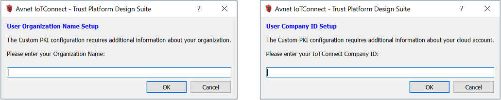
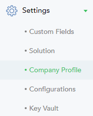
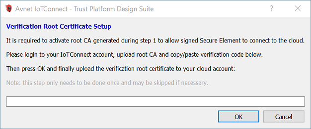
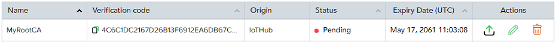
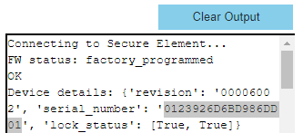
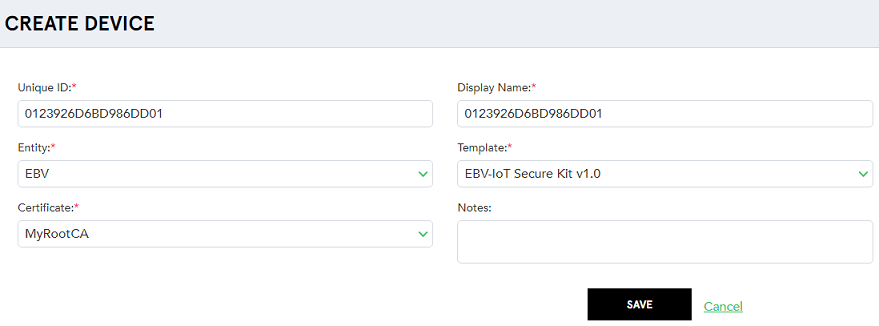

# Trust Platform Design Suite - Usecase Help - Custom PKI Avnet IoTConnect

This document helps to understand all steps of Usecase transaction diagram.

## Setup requirements
 - [Microchip SAM V71 Xplained Ultra](https://www.microchip.com/developmenttools/ProductDetails/atsamv71-xult)
 - [EBV-IoT Microchip Secure Shield](https://iotconnect.io/ebv/ebv-mchp-secure-solution.html)
 - [EBV Heracles 324G](https://www.avnet.com/wps/portal/ebv/products/new-products/npi/2020/ebv-elektronik-heracles-324/)
 - [ST X-NUCLEO-IKS01A2](https://www.st.com/en/ecosystems/x-nucleo-iks01a2.html) *(optional)*
 
 - [MPLAB X IDE](https://www.microchip.com/en-us/development-tools-tools-and-software/mplab-x-ide) 5.45 or above

## Pre Usecase transaction Steps
First start by requesting your **free Avnet IoTConnect cloud account** [here](https://iotconnect.io/ebv/).

 - Make sure EBV-IoT Microchip Secure Shield switch is set to **PROG** position <u>before connecting USB port</u>.
 - Connect EBV-IoT Microchip Secure Shield USB port to PC running Trust Platform Design Suite.
 - Ensure *MPLAB X Path* is set in *File* => *Preference* under *System Settings* as this helps:
    - To program the Usecase prototyping kit to factory reset application by TPDS.
    - To open the embedded project of the Usecase.

## Usecase transaction Steps
**Step 1** requires some information to build the custom PKI for Avnet IoTConnect cloud:

 - **Organization Name** can be any desired name.
 - **Company ID** is a unique identifier related to your Avnet IoTConnect cloud account:
	- Login to your [Avnet IoTConnect](https://avnet.iotconnect.io/) account.
	- Go to **Settings** tab then select **Company Profile**.
	
		
	
	- Locate **CPID** field and click the copy icon . Paste value in the corresponding usecase popup.

**Step 2** requires some information to register the root CA certificate to Avnet IoTConnect cloud (only required once per root CA):

 - **Verification code** can be retrieve from the cloud as following:
	- Login to your [Avnet IoTConnect](https://avnet.iotconnect.io/) account.
		- Go to **Devices** tab then select **Certificates** and click **CA CERTIFICATE** button.
		- Choose a name for your root CA certificate then upload root CA certificate file [root_crt.cer](../../avnet_iotconnect) and click **SAVE**.
		
			
		
		- The root CA certificate is not yet activated and has *pending* status. Below **Verification code** click the copy icon  and paste it in the corresponding usecase popup then press **OK**.

			

		- TPDS has now created a verification root certificate. In the cloud **CA CERTIFICATES** menu, locate your root CA and corresponding **Actions** column and click the upload icon .
		- Upload verification root certificate [root_verification.cer](../../avnet_iotconnect).
 
After **all** steps are passed, create the device associated resources in Avnet IoTConnect cloud:

 - Register the device template in the cloud as following (only required once per template):
	- Login to your [Avnet IoTConnect](https://avnet.iotconnect.io/) account.
		- Go to **Devices** tab then **Device** and on the left pane click **Templates**.
		- Click **CREATE TEMPLATE** then click **QUICK ADD** button.
		- Browse and select file [EBV-IoT Secure Kit v1.0_template.json](../../avnet_iotconnect) and click **SAVE**.

 - Create the new device in the cloud as following:
	- Go to **Devices** tab on the left pane then click **CREATE DEVICE** button:
		- **Unique ID** must be the serial number of the ATECC608. It is displayed in the output view of the usecase as shown below:
		
			
		
		- **Display Name** can be any desired name.
		- **Entity** must be your entity name.
		- **Template** must be set to "*EBV-IoT Secure Kit v1.0*".
		- **Certificate** select root CA certificate registered in step 2 and click **SAVE**.
		
			

The Avnet IoTConnect cloud setup is complete.  

## Post Usecase transaction Steps
On completing Usecase steps execution on TPDS, it is possible to either run the embedded project or view C source files by clicking *MPLAB X Project* or *C Source Folder* button.

- Disconnect EBV-IoT Microchip Secure Shield USB port from PC and set switch to **EXT** position.

- Once the Usecase project is loaded on MPLAB X IDE:
    - Set the project as Main => right click on Project and select *Set as Main Project*
    - Set **Avnet IoTConnect Endpoint** => Open *main.c* under Project Source Files => main.c and locate macro *IOTCONNECT_CONF_SERVER_ADDRESS*:
        - On Avnet IoTConnect cloud, go to **Devices** tab then **Device** and click your device **Unique ID**. On the right side click **Connection info** and copy **# host** value and paste it in macro *IOTCONNECT_CONF_SERVER_ADDRESS*.
    - Set **Avnet IoTConnect Template GUID** => Open *main.c* under Project Source Files => main.c and locate macro *IOTCONNECT_CONF_DEVICE_DTG*:
        - On Avnet IoTConnect cloud, go to **Devices** tab then **Device** and click your device **Unique ID**. Locate **DTG** and click the copy icon . Paste value in macro *IOTCONNECT_CONF_DEVICE_DTG*.
	- If your MPLAB X Project is located outside TPDS, you need to copy [cust_def C source and header files](../../avnet_iotconnect) to your project location.

    - Build and Program the project => right click on Project and select *Make and Program Device*.
	- Log from the embedded project can be viewed using applications like TeraTerm. Select the COM port and set baud rate as 115200-8-N-1.

The device is ready to authenticate with the Avnet IoTConnect cloud.  

